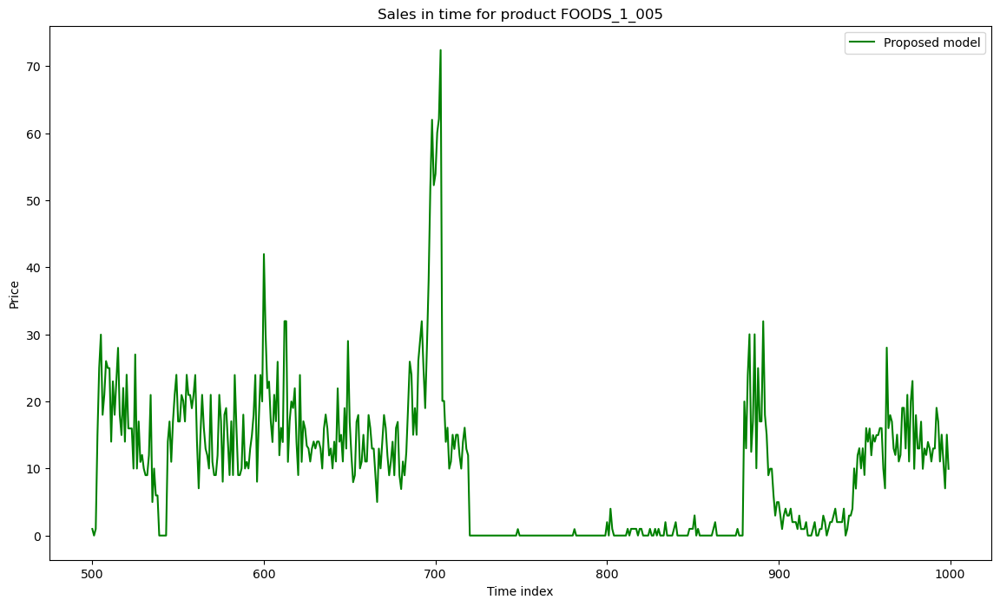

## Repository for the article *Synthetic Time Series Generation for Decision Intelligence Using Large Language Models*

### Proposed model

A model for generating synthetic time series data using pre-trained large language models is proposed. Starting with Google T5-base model, which employs an encoder-decoder transformer architecture, the model undergoes pre-training on diverse datasets. It is then fine-tuned using the QLoRA technique, which reduces computational complexity by quantizing weight parameters. The process involves tokenization of time series data through mean scaling and quantization. The performance of the model is evaluated with fidelity, utility, and privacy metrics, showing improvements in fidelity and utility but a trade-off with reduced privacy. The proposed model offers a foundation for decision intelligence systems.

### Input data

The input data uses the times series of the sales of products from the [M5 forecasting accuracy](https://www.kaggle.com/competitions/m5-forecasting-accuracy) dataset.

|FOODS_1_001|FOODS_1_002|FOODS_1_003|FOODS_1_004|FOODS_1_005|FOODS_1_006|FOODS_1_008|FOODS_1_009|FOODS_1_010|...|
|-----------|-----------|-----------|-----------|-----------|-----------|-----------|-----------|-----------|-----------|
|9.0        |5.0        |23.0       |0.0        |26.0       |21.0       |0.0        |0.0        |0.0        |  |
|9.0        |4.0        |16.0       |0.0        |30.0       |19.0       |0.0        |0.0        |0.0        |  |
|8.0        |2.0        |7.0        |0.0        |34.0       |26.0       |0.0        |0.0        |0.0        |  |
|5.0        |2.0        |12.0       |0.0        |14.0       |9.0        |0.0        |0.0        |0.0        |  |
|14.0       |4.0        |6.0        |0.0        |36.0       |14.0       |0.0        |0.0        |0.0        |  |
|26.0       |3.0        |5.0        |0.0        |25.0       |17.0       |0.0        |0.0        |0.0        |  |
|8.0        |5.0        |7.0        |0.0        |9.0        |21.0       |0.0        |0.0        |0.0        |  |
|12.0       |7.0        |10.0       |0.0        |37.0       |28.0       |0.0        |0.0        |0.0        |  |
|13.0       |3.0        |6.0        |0.0        |39.0       |19.0       |0.0        |0.0        |0.0        |  |
|5.0        |3.0        |10.0       |0.0        |18.0       |18.0       |0.0        |0.0        |0.0        |  |

### Results

#### Output

The output data contains new time series generated for the products

|FOODS_1_001|FOODS_1_002|FOODS_1_003|FOODS_1_004|FOODS_1_005|FOODS_1_006|FOODS_1_008|FOODS_1_009|FOODS_1_010|...|
|-----------|-----------|-----------|-----------|-----------|-----------|-----------|-----------|-----------|-----------|
|7.9772744  |1.9886382  |4.0183244  |0.0        |18.059378  |12.969387  |0.0        |0.0        |0.5625     |  |
|12.999997  |1.9886382  |2.9791071  |0.0        |22.005142  |16.998724  |0.0        |0.0        |0.0        |  |
|12.999997  |3.0113645  |9.006598   |0.0        |18.059378  |21.028046  |0.0        |0.0        |0.0        |  |
|14.994318  |4.999999   |9.006598   |0.0        |35.05645   |27.953451  |0.0        |0.0        |0.0        |
|11.965907  |4.0056834  |4.988274   |0.0        |20.942816  |14.984048  |0.0        |0.0        |0.0        |  |
|9.971596   |10.000002  |6.9974318  |0.0        |25.950886  |19.013386  |0.0        |0.0        |0.0        |  |
|7.9772744  |0.9943191  |6.9974318  |0.0        |35.967007  |18.006056  |0.0        |0.0        |0.0        |  |
|5.9829535  |8.011363   |2.0091667  |0.0        |11.989002  |19.013386  |0.0        |0.0        |0.0        |  |
|9.971596   |3.0113645  |9.976539   |0.0        |20.032259  |7.0513124  |0.0        |0.0        |0.0        |  |
|11.005686  |3.0113645  |7.967372   |0.0        |20.942816  |20.020716  |0.0        |0.0        |0.5625     |  |

#### Time series

Example of generated time series visualization.

| Model | Time series |
| ------------- | ------------- |
| Original data  |  |
| GAN  |  |
| TimeGAN  |  |
| DoppelGANger  |  |
| Proposed model  |  |

#### Distribution of output values

The comparison of output values between models.

#### References:

*Can be seen in the article*